# 校园互助服务平台用例图

## 一、系统总览用例图

```mermaid
graph LR
    %% ========== 样式定义 ==========
    classDef actor fill:#e1f5fe,stroke:#01579b,stroke-width:2px,color:#000,font-weight:bold
    classDef usecase fill:#fff8e1,stroke:#ff6f00,stroke-width:1.5px,color:#000
    classDef admin fill:#fce4ec,stroke:#880e4f,stroke-width:2px,color:#000,font-weight:bold
    classDef system fill:#e8f5e9,stroke:#1b5e20,stroke-width:2px,color:#000,font-weight:bold
    classDef group fill:none,stroke:#9e9e9e,stroke-width:1px,stroke-dasharray: 5 5

    %% ========== 参与者 ==========
    S(("🎓<br/>在校学生"))
    A(("🔧<br/>平台管理员"))
    T(("⏰<br/>定时任务"))

    %% ========== 用户管理与认证 ==========
    subgraph U["用户管理与认证"]
        UC01(("UC01<br/>SSO学号认证登录"))
        UC02(("UC02<br/>编辑个人资料与专长标签"))
        UC03(("UC03<br/>配置隐私设置"))
        UC04(("UC04<br/>查看信用分与历史订单"))
    end

    %% ========== 需求发布与浏览 ==========
    subgraph D["需求发布与浏览"]
        UC05(("UC05<br/>发布互助需求"))
        UC06(("UC06<br/>添加需求标签"))
        UC07(("UC07<br/>浏览与筛选需求列表"))
        UC08(("UC08<br/>编辑/下架需求"))
        UC09(("UC09<br/>查看需求详情"))
    end

    %% ========== 订单生命周期 ==========
    subgraph O["订单生命周期"]
        UC10(("UC10<br/>接单"))
        UC11(("UC11<br/>提交完成凭证"))
        UC12(("UC12<br/>确认完成与报酬转移"))
        UC13(("UC13<br/>发起争议仲裁"))
        UC14(("UC14<br/>双向匿名评价"))
    end

    %% ========== 消息通信 ==========
    subgraph N["消息通信"]
        UC15(("UC15<br/>向陌生人打招呼"))
        UC16(("UC16<br/>接单后私聊沟通"))
        UC17(("UC17<br/>接收站内通知"))
    end

    %% ========== 积分与报酬 ==========
    subgraph P["积分与报酬"]
        UC18(("UC18<br/>设置积分悬赏"))
        UC19(("UC19<br/>获取积分奖励"))
        UC20(("UC20<br/>积分兑换商品"))
    end

    %% ========== 管理后台 ==========
    subgraph M["管理后台"]
        UC21(("UC21<br/>用户封禁与解封"))
        UC22(("UC22<br/>内容审核与违规处理"))
        UC23(("UC23<br/>争议仲裁处理"))
        UC24(("UC24<br/>查看运营数据统计"))
    end

    %% ========== 系统自动化 ==========
    subgraph S2["系统自动化"]
        UC25(("UC25<br/>超时自动确认订单"))
        UC26(("UC26<br/>超时未接单提醒"))
        UC27(("UC27<br/>信用分自动计算"))
    end

    %% ========== 关联：学生 → 用例 ==========
    S --- UC01
    S --- UC02
    S --- UC03
    S --- UC04
    S --- UC05
    S --- UC06
    S --- UC07
    S --- UC08
    S --- UC10
    S --- UC11
    S --- UC12
    S --- UC13
    S --- UC14
    S --- UC15
    S --- UC16
    S --- UC17
    S --- UC18
    S --- UC19
    S --- UC20

    %% ========== 关联：管理员 → 用例 ==========
    A --- UC21
    A --- UC22
    A --- UC23
    A --- UC24

    %% ========== 关联：定时任务 → 用例 ==========
    T --- UC25
    T --- UC26
    T --- UC27

    %% ========== Include 关系（实线 + include标签）==========
    UC05 ==> |"《include》"| UC09
    UC10 ==> |"《include》"| UC09
    UC12 ==> |"《include》"| UC14
    UC05 ==> |"《include》"| UC18

    %% ========== Extend 关系（虚线 + extend标签）==========
    UC06 -.-> |"《extend》"| UC05
    UC13 -.-> |"《extend》"| UC12
    UC25 -.-> |"《extend》"| UC12
    UC26 -.-> |"《extend》"| UC05

    %% ========== 样式应用 ==========
    class S actor
    class A admin
    class T system
    class UC01,UC02,UC03,UC04,UC05,UC06,UC07,UC08,UC09,UC10,UC11,UC12,UC13,UC14,UC15,UC16,UC17,UC18,UC19,UC20,UC21,UC22,UC23,UC24,UC25,UC26,UC27 usecase
```

---

## 二、用例说明表

| 用例编号 | 用例名称 | 参与者 | 优先级 | 对应需求ID | 说明 |
|---------|---------|--------|--------|-----------|------|
| UC01 | SSO学号认证登录 | 在校学生 | P0 | FR-U01 | 通过校园统一身份认证完成注册与登录 |
| UC02 | 编辑个人资料与专长标签 | 在校学生 | P0 | FR-U02 | 编辑个人简介、专长标签等展示信息 |
| UC03 | 配置隐私设置 | 在校学生 | P0 | FR-U03 | 设置历史记录可见性、匿名昵称等 |
| UC04 | 查看信用分与历史订单 | 在校学生 | P0 | FR-U04 | 查看个人信用分、等级及历史订单 |
| UC05 | 发布互助需求 | 在校学生 | P0 | FR-D01 | 填写标题、描述、分类、地点、报酬等发布需求 |
| UC06 | 添加需求标签 | 在校学生 | P1 | FR-D02 | 为需求添加标签以提高检索精度 |
| UC07 | 浏览与筛选需求列表 | 在校学生 | P0 | FR-D03 | 按分类、时间、距离、报酬等条件筛选 |
| UC08 | 编辑/下架需求 | 在校学生 | P0 | FR-D05 | 仅在"待接单"状态下可编辑或下架 |
| UC09 | 查看需求详情 | 在校学生 | P0 | FR-D04 | 查看发布者信用、模糊位置、需求详情 |
| UC10 | 接单 | 在校学生 | P0 | FR-O01 | 帮助方承接待接单的互助需求 |
| UC11 | 提交完成凭证 | 在校学生 | P0 | FR-O02 | 上传图片等凭证证明任务已完成 |
| UC12 | 确认完成与报酬转移 | 在校学生 | P0 | FR-O03 | 求助方确认完成后，积分报酬自动转移 |
| UC13 | 发起争议仲裁 | 在校学生 | P0 | FR-O06 | 对订单结果有异议时向平台发起申诉 |
| UC14 | 双向匿名评价 | 在校学生 | P0 | FR-E01 | 订单完成后双方进行匿名评分与评价 |
| UC15 | 向陌生人打招呼 | 在校学生 | P0 | FR-N02 | 接单前向需求发布者发送一条预沟通消息 |
| UC16 | 接单后私聊沟通 | 在校学生 | P0 | FR-N03 | 订单进行中双方进行站内私聊 |
| UC17 | 接收站内通知 | 在校学生 | P0 | FR-N01 | 接收接单、状态变更、系统提醒等通知 |
| UC18 | 设置积分悬赏 | 在校学生 | P0 | FR-P01 | 发布需求时设置悬赏积分数额 |
| UC19 | 获取积分奖励 | 在校学生 | P0 | FR-P01 | 完成互助任务后获得积分奖励 |
| UC20 | 积分兑换商品 | 在校学生 | P0 | FR-P02 | 使用积分兑换小黄车月卡、奶茶折扣等 |
| UC21 | 用户封禁与解封 | 平台管理员 | P0 | FR-A01 | 对违规用户进行封禁或解封处理 |
| UC22 | 内容审核与违规处理 | 平台管理员 | P0 | FR-A02 | 审核举报内容，处理违规帖子 |
| UC23 | 争议仲裁处理 | 平台管理员 | P0 | FR-A04 | 查看证据（聊天记录、凭证、位置），做出仲裁判定 |
| UC24 | 查看运营数据统计 | 平台管理员 | P0 | FR-A03 | 查看DAU、订单量、分类分布、信用分分布等 |
| UC25 | 超时自动确认订单 | 定时任务系统 | P0 | FR-O04 | 求助方72小时未确认则自动完成订单 |
| UC26 | 超时未接单提醒 | 定时任务系统 | P1 | FR-D06 | 需求发布24小时后仍待接单则提醒发布者 |
| UC27 | 信用分自动计算 | 定时任务系统 | P0 | FR-E02 | 根据订单完成、投诉、爽约等数据自动计算信用分 |

---

## 三、核心用例详解

以下对系统三个最核心的用例进行详细描述，采用标准用例详述模板：用例编号、用例名称、参与者、用例目标、前置条件、后置条件、主流程（基本事件流）、异常/分支流程。

### UC13 发起争议仲裁

| 字段 | 内容 |
|------|------|
| **用例编号** | UC13 |
| **用例名称** | 发起争议仲裁 |
| **参与者** | 在校学生（求助方/帮助方） |
| **用例目标** | 订单参与方对任务完成情况或结果存在异议时，向平台提交申诉并请求管理员介入裁决 |
| **优先级** | P0 |
| **对应需求** | FR-O06 |

**前置条件**：
- 用户已登录且为订单的求助方或帮助方之一；
- 订单状态为"待确认"或"已完成"（已完成订单须在确认后24小时内发起）；
- 该订单此前未被提交过争议仲裁。

**后置条件**：
- 争议发起成功：订单状态冻结为"争议中"，积分划转暂停或已划转积分被临时冻结，生成仲裁工单推送至管理员后台；
- 争议发起失败：订单状态不变，不产生仲裁工单。

**主流程（基本事件流）**：

| 步骤 | 参与者动作 | 系统响应 |
|------|-----------|---------|
| 1 | 用户在订单详情页点击"发起争议"按钮 | 系统展示争议申诉表单 |
| 2 | 用户选择争议类型（任务未完成/未按约定执行/恶意不确认/其他），填写争议原因描述（必填，50-500字） | — |
| 3 | 用户勾选希望平台审查的证据类型（可多选：聊天记录/完成凭证照片/地点签到记录/时间线） | — |
| 4 | 用户点击"提交争议" | 系统校验用户是否为订单参与方、订单状态是否允许发起争议、该订单是否已有未处理的争议 |
| 5 | — | 校验通过后，系统将订单状态更新为"争议中"，锁定积分（若未划转则冻结，若已划转则标记为待退回） |
| 6 | — | 系统自动汇总双方聊天记录、完成凭证、位置信息、订单时间线等证据，生成仲裁工单（Ticket） |
| 7 | — | 工单推送至管理员后台"待处理争议"队列，同时向双方发送"争议已提交，等待平台处理"站内通知 |
| 8 | — | 系统向用户展示"争议提交成功，工单号：T-XXXX，预计3个工作日内处理"提示 |

**异常/分支流程**：

| 步骤 | 触发条件 | 系统响应 |
|------|---------|---------|
| 4a | 用户非订单参与方（如第三方用户尝试发起） | 系统拒绝提交并提示"您不是该订单的参与方，无权发起争议" |
| 4b | 订单状态为"进行中"（尚未提交完成凭证） | 系统提示"任务尚未提交完成，请等待对方提交凭证后再发起争议" |
| 4c | 订单已完成且超过24小时争议有效期 | 系统提示"该订单已超过争议有效期（24小时），无法发起争议" |
| 4d | 该订单已存在未处理的争议工单 | 系统提示"该订单已存在进行中争议，请勿重复提交"，并展示现有工单号 |
| 4e | 争议原因描述少于50字 | 系统提示"请详细描述争议原因（至少50字）"，阻止提交 |

---

### UC05 发布互助需求

| 字段 | 内容 |
|------|------|
| **用例编号** | UC05 |
| **用例名称** | 发布互助需求 |
| **参与者** | 在校学生（求助方） |
| **用例目标** | 求助方在平台发布一条互助需求，供其他校内同学浏览和接单 |
| **优先级** | P0 |
| **对应需求** | FR-D01 |

**前置条件**：
- 用户已登录且账户状态正常；
- 若选择积分悬赏类型，用户积分余额须大于等于悬赏数额。

**后置条件**：
- 发布成功：需求进入"待接单"状态，出现在需求广场，系统扣除相应积分（若悬赏）；
- 发布失败：需求未创建，积分未扣除，用户留在发布页。

**主流程（基本事件流）**：

| 步骤 | 参与者动作 | 系统响应 |
|------|-----------|---------|
| 1 | 用户点击首页"发布需求"按钮 | 系统展示发布表单页面 |
| 2 | 用户填写标题（2-50字）、详细描述（≤500字）、选择分类（快递代取/学习辅导/二手交易/活动组队/失物招领/咨询/其他） | — |
| 3 | 用户选择地点（地图选点或文字输入）、期望完成时间 | — |
| 4 | 用户选择报酬类型：积分悬赏/无偿；若选择积分悬赏，填写积分数额 | — |
| 5 | （可选）用户添加最多3个标签（《extend》UC06） | — |
| 6 | 用户点击"发布"按钮 | 系统校验所有必填项、标题长度、分类合法性 |
| 7 | — | 若选择积分悬赏，系统校验用户当前积分余额是否充足 |
| 8 | — | 校验全部通过后，生成状态为"待接单"的需求订单，若含悬赏则冻结对应积分 |
| 9 | — | 系统将需求加入需求广场索引，向用户展示"发布成功"提示并跳转至需求详情页（《include》UC09） |

**异常/分支流程**：

| 步骤 | 触发条件 | 系统响应 |
|------|---------|---------|
| 6a | 标题为空或超过50字 | 系统提示"标题需在2-50字之间"，阻止提交 |
| 6b | 未选择分类 | 系统提示"请选择需求分类"，阻止提交 |
| 7a | 积分悬赏数额大于用户当前余额 | 系统提示"积分余额不足，请调整悬赏金额或选择无偿帮助"，阻止提交 |
| 7b | 积分数额为负数或零 | 系统提示"悬赏积分须为正整数"，阻止提交 |

---

### UC10 接单

| 字段 | 内容 |
|------|------|
| **用例编号** | UC10 |
| **用例名称** | 接单 |
| **参与者** | 在校学生（帮助方） |
| **用例目标** | 帮助方浏览需求列表，选择并承接一个待接单的互助任务 |
| **优先级** | P0 |
| **对应需求** | FR-O01 |

**前置条件**：
- 用户已登录且账户状态正常（未被封禁）；
- 目标需求当前状态为"待接单"；
- 用户不能承接自己发布的需求。

**后置条件**：
- 接单成功：需求状态变更为"进行中"，系统记录帮助方ID，双方建立订单关系；
- 接单失败：需求状态不变，不产生订单关系。

**主流程（基本事件流）**：

| 步骤 | 参与者动作 | 系统响应 |
|------|-----------|---------|
| 1 | 用户在需求广场浏览并点击某条需求卡片 | 系统展示需求详情页（《include》UC09），包含发布者信用等级、模糊位置、需求描述、报酬信息 |
| 2 | 用户确认信息无误后，点击"接单"按钮 | — |
| 3 | — | 系统使用数据库行锁锁定该需求记录，防止并发冲突 |
| 4 | — | 系统校验需求当前状态是否为"待接单"，以及接单者是否为需求发布者本人 |
| 5 | — | 校验通过后，将需求状态更新为"进行中"，记录帮助方用户ID，创建订单关联 |
| 6 | — | 系统释放数据库锁 |
| 7 | — | 系统向求助方发送"您的需求已被接单"站内通知（《include》UC17），向帮助方展示"接单成功"提示 |
| 8 | — | 系统自动开通双方私信通道（《include》UC16），允许沟通任务细节 |

**异常/分支流程**：

| 步骤 | 触发条件 | 系统响应 |
|------|---------|---------|
| 4a | 需求状态已非"待接单"（已被他人接单或已下架） | 系统释放锁，提示"该需求已被其他用户接单"或"该需求已下架"，不更新状态 |
| 4b | 用户尝试承接自己发布的需求 | 系统释放锁，提示"不能承接自己发布的需求"，不更新状态 |
| 4c | 用户信用分低于平台设定的接单门槛（如低于30分） | 系统释放锁，提示"您的信用分暂不满足接单条件，请提升信用分后重试" |

---

## 四、关键用例关系说明

### 4.1 Include（包含）关系

| 基础用例 | 被包含用例 | 说明 |
|---------|-----------|------|
| UC05 发布互助需求 | UC09 查看需求详情 | 发布成功后系统自动展示需求详情页确认 |
| UC10 接单 | UC09 查看需求详情 | 接单前必须查看需求详情确认信息 |
| UC12 确认完成与报酬转移 | UC14 双向匿名评价 | 确认完成后系统要求双方完成评价 |
| UC05 发布互助需求 | UC18 设置积分悬赏 | 若选择积分悬赏类型，则必须设置积分数额 |

### 4.2 Extend（扩展）关系

| 扩展用例 | 被扩展用例 | 触发条件 |
|---------|-----------|---------|
| UC06 添加需求标签 | UC05 发布互助需求 | 用户主动选择添加标签（可选） |
| UC13 发起争议仲裁 | UC12 确认完成与报酬转移 | 任一方对订单结果有异议时触发 |
| UC25 超时自动确认订单 | UC12 确认完成与报酬转移 | 求助方超过72小时未手动确认时触发 |
| UC26 超时未接单提醒 | UC05 发布互助需求 | 需求发布超过24小时仍无人接单时触发 |

### 4.3 继承/泛化关系

本系统用例图中**未使用泛化关系**。所有需求发布（包括二手交易、失物招领、跑腿等）统一通过 "UC05 发布互助需求" 完成，通过**分类字段**区分不同类型的需求，而非通过用例泛化。这种设计保持了系统的简洁性，避免用例过度拆分。

---

## 五、用例图设计说明

### 4.1 参与者定义

- **在校学生**：平台的核心用户，既是求助方（发布需求）也是帮助方（承接需求）。同一账号可在不同场景中扮演两种角色，因此统一建模为"在校学生"参与者，而非拆分为两个独立角色。
- **平台管理员**：负责平台运营、内容审核、争议仲裁与数据监控，通常是经过授权的学生志愿者或运营人员。
- **定时任务系统**：非人类参与者，负责执行定时触发的后台任务（如超时自动确认、信用分计算、未接单提醒）。

### 4.2 用例粒度

用例粒度遵循**一个完整用户目标**原则：
- **粗粒度用例**：发布互助需求（UC05）、接单（UC10）、确认完成（UC12）——对应用户的一个完整业务目标。
- **细粒度用例**：添加标签（UC06）、设置积分悬赏（UC18）——作为包含或扩展用例存在，不独立触发。

### 4.3 与需求规格说明书的映射

本用例图基于 `refine.md`（v2.1 修订版）中的功能需求设计，用例编号与需求ID的映射关系见第二节"用例说明表"。每个P0优先级的功能需求均已对应用例覆盖，P1优先级需求作为扩展用例体现。
