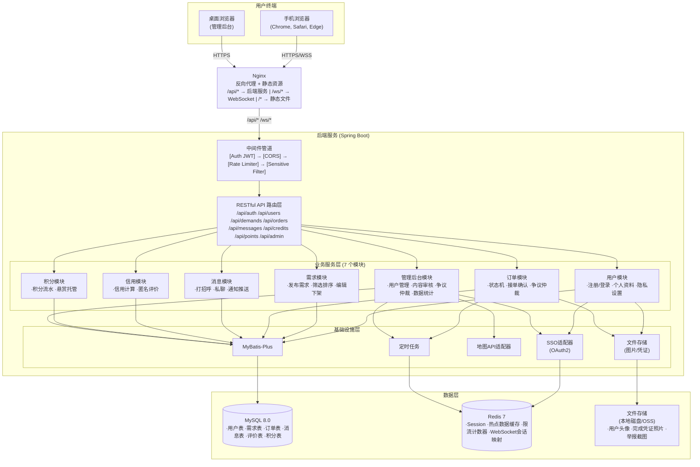
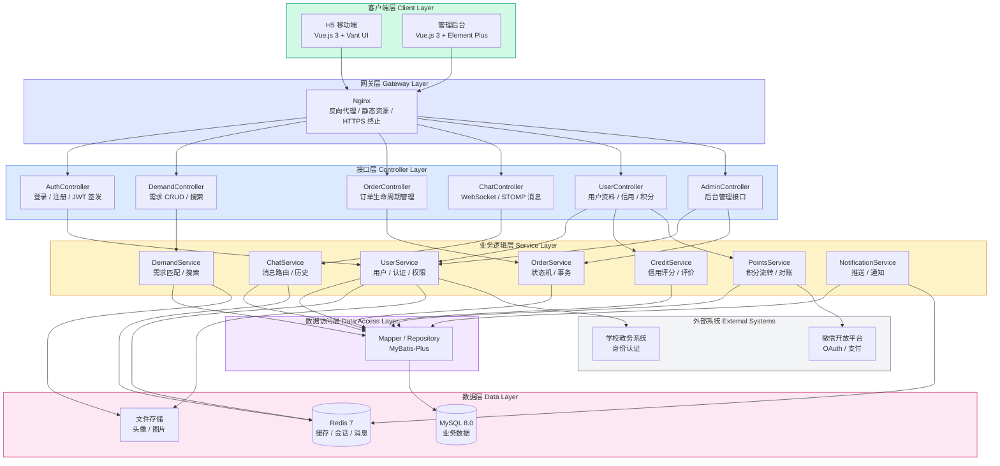
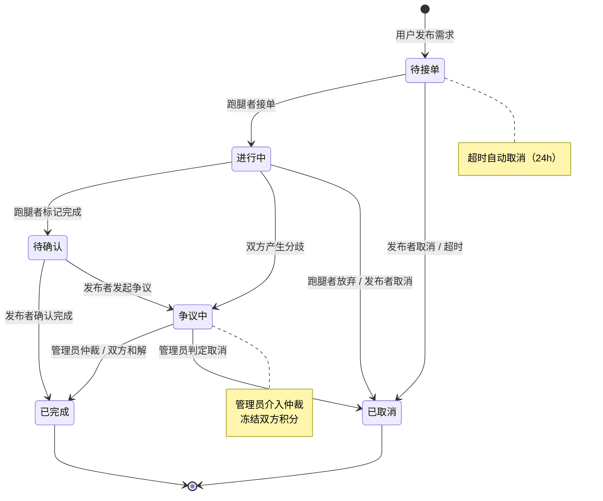
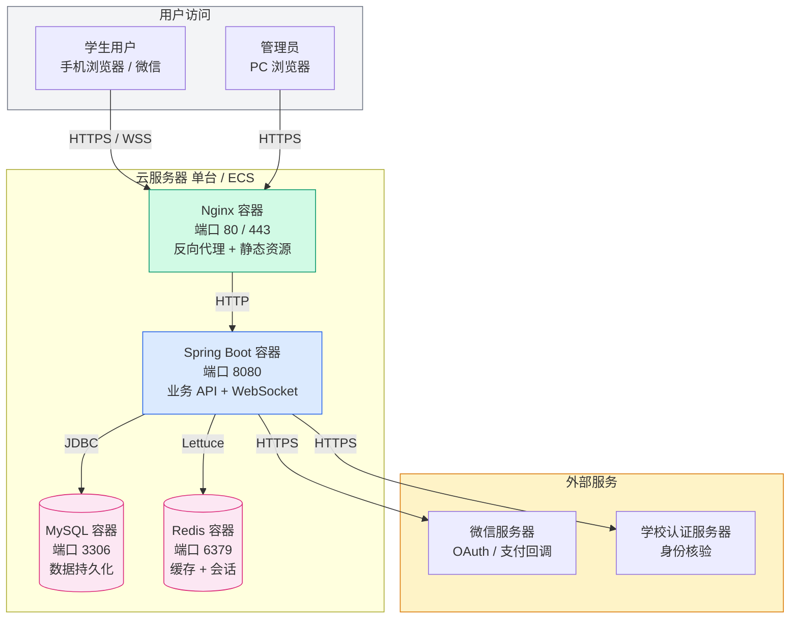
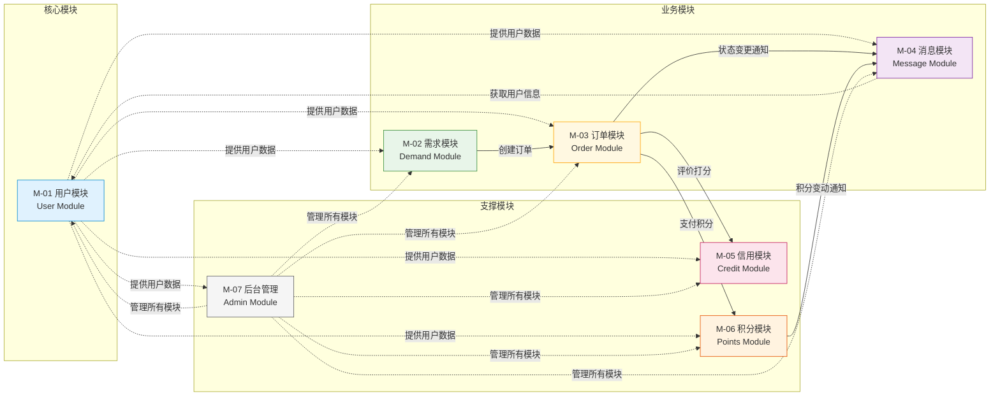
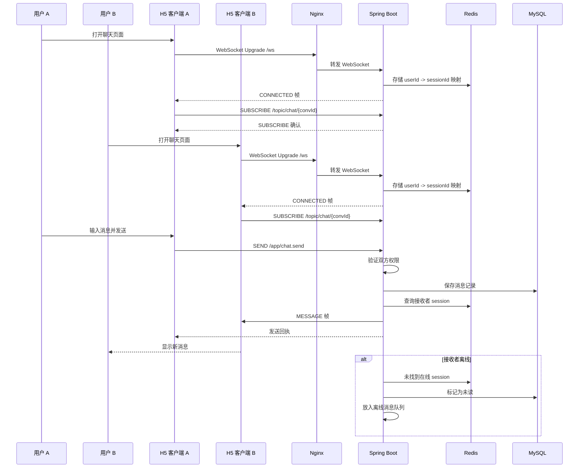
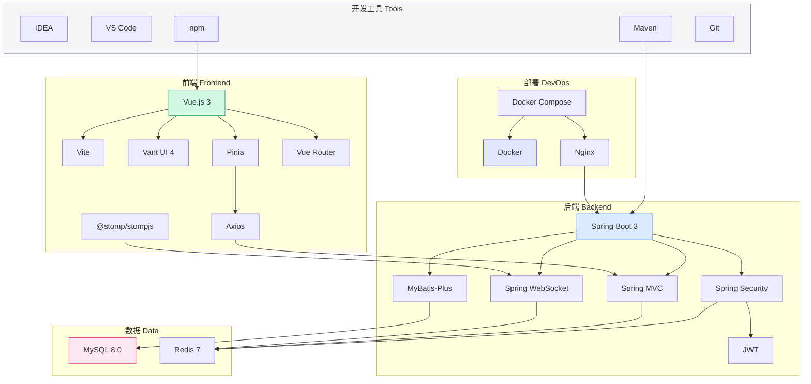

# **校园互助服务平台 — 架构设计文档**


**日期：** 2026-05-04

**团队：** 草莓拿铁


---


## **目录**


1. [架构概览](#1-架构概览)

2. [模块划分说明](#2-模块划分说明)

3. [技术选型说明](#3-技术选型说明)

4. [架构决策记录 ADR 集合](#4-架构决策记录-adr-集合)

---


## **1. 架构概览**


### **1.1 架构风格**


**前后端分离 + 分层模块化单体架构**


本系统采用前后端分离的模块化单体架构。前端为 Vue.js 3 单页应用（SPA），通过 HTTPS RESTful API 与后端通信；后端为 Spring Boot 单体进程，内部按业务领域划分为 7 个模块，模块间通过 Service 接口调用，禁止跨模块直接访问数据表。


### **1.2 架构总览图**





### **1.3 后端分层架构图**




### **1.4 分层职责说明**


| 层 | 职责 | 不应做的事 |
| - | -- | ----- |
| **中间件层** | 横切关注点：认证鉴权(JWT)、CORS、限流、请求日志、敏感词过滤、异常统一处理 | 不应包含业务逻辑 |
| **路由/控制层** | 请求参数校验、调用 Service、组装 HTTP 响应 | 不应包含业务逻辑、不应直接访问数据库 |
| **业务服务层** | 核心业务逻辑、事务管理(@Transactional)、模块间协调 | 不应处理 HTTP 请求/响应细节 |
| **基础设施层** | 数据库访问(MyBatis-Plus Mapper)、外部 API 调用封装、文件存储抽象、定时任务 | 不应包含业务判断 |
| **数据层** | 持久化存储(MySQL)、缓存(Redis)、文件存储 | — |


### **1.5 核心特征**


| 维度 | 说明 |
| -- | -- |
| **部署单元** | 1 个前端静态资源 + 1 个后端 JAR 进程 = 2 个部署单元 |
| **模块边界** | 后端按业务领域分为 7 个模块，模块间仅通过 Service 接口调用 |
| **通信方式** | 前端↔后端：RESTful API (JSON) + WebSocket(STOMP)；模块间：同步方法调用 |
| **数据管理** | 共享数据库，每个模块拥有独立的 Mapper 层；禁止跨模块直接访问其他模块的数据表 |
| **实时能力** | Spring WebSocket (STOMP) 内嵌于后端进程，无需独立消息中间件 |


### **1.6 订单状态机**




> 实线箭头 = 正常状态流转
> 虚线箭头 = 异常/取消分支

订单状态机由 `OrderService` 统一管理，所有状态变更必须通过 `OrderService.transition(orderId, action)` 方法，该方法内部校验状态转换合法性。


### **1.7 部署架构图**




---


## **2. 模块划分说明**


### **2.1 模块一览**


| 模块 ID | 模块名称           | 核心职责                         | 依赖模块                               |
| ----- | -------------- | ---------------------------- | ---------------------------------- |
| M-01  | 用户模块 (User)    | SSO 认证、注册、个人信息管理、隐私设置        | 无                                  |
| M-02  | 需求模块 (Demand)  | 需求发布、编辑、下架、筛选排序、标签           | M-01, M-06                         |
| M-03  | 订单模块 (Order)   | 接单、凭证提交、确认完成、状态机、争议          | M-01, M-02, M-04, M-05, M-06, M-07 |
| M-04  | 消息模块 (Message) | 打招呼、私聊（WebSocket/STOMP）、系统通知 | M-01, M-03                         |
| M-05  | 信用模块 (Credit)  | 信用分计算、匿名评价、违规扣分              | M-01, M-03                         |
| M-06  | 积分模块 (Points)  | 积分流水、悬赏托管、兑换商城               | M-01                               |
| M-07  | 管理后台模块 (Admin) | 用户封禁、内容审核、争议仲裁、数据统计          | M-01, M-02, M-03, M-05             |

###

### **2.2 模块依赖图**




> 实线箭头 = 强依赖（直接调用 Service 接口）
> 虚线箭头 = 弱依赖（仅查询数据，无业务耦合）

**依赖规则：**

- 上游模块依赖下游模块的 Service 接口（不依赖其内部实现）
- 不允许循环依赖
- M-03（订单模块）是业务流程的编排中心，协调各模块完成"接单→执行→确认→评价"的完整链路


### **2.3 模块间接口定义**


#### **2.3.1 RESTful API 清单（核心接口）**


```
用户与认证
POST   /api/auth/login              # SSO 登录
POST   /api/auth/logout             # 登出
GET    /api/users/me                # 获取当前用户信息
PUT    /api/users/me                # 更新个人信息
GET    /api/users/:id/profile       # 查看他人主页（信用分+历史）

需求管理
POST   /api/demands                 # 发布需求
GET    /api/demands                 # 需求列表（支持筛选排序分页）
GET    /api/demands/:id             # 需求详情
PUT    /api/demands/:id             # 编辑需求（仅待接单状态）
DELETE /api/demands/:id             # 下架需求

订单管理
POST   /api/orders                  # 接单 { demandId }
POST   /api/orders/:id/complete     # 提交完成凭证
POST   /api/orders/:id/confirm      # 求助方确认完成
POST   /api/orders/:id/dispute      # 发起争议
GET    /api/orders                  # 我的订单列表
GET    /api/orders/:id              # 订单详情

消息
GET    /api/messages/conversations  # 私聊会话列表
GET    /api/messages/:convId        # 聊天记录
POST   /api/messages/say-hello      # 打招呼
GET    /api/notifications           # 系统通知列表
WSS    /ws/chat                     # WebSocket 实时消息 (STOMP)

评价与信用
POST   /api/reviews                 # 提交评价
GET    /api/credits/:userId         # 查询信用分

积分
GET    /api/points/balance          # 我的积分余额
GET    /api/points/transactions     # 积分流水
POST   /api/points/exchange         # 积分兑换

管理后台
GET    /api/admin/users             # 用户列表
POST   /api/admin/users/:id/ban     # 封禁用户
GET    /api/admin/reports           # 举报列表
POST   /api/admin/disputes/:id/judge # 争议仲裁
GET    /api/admin/stats             # 数据统计

```

#### **2.3.2 模块间内部接口（Java Service 接口契约）**

```java
// 订单模块调用积分模块的接口
public interface PointsService {
    /**
     * 扣除积分（发布悬赏时调用）
     * @throws InsufficientPointsException 积分不足
     */
    String deduct(String userId, int amount, String reason);

    /** 转移积分（确认完成时调用）：从平台托管账户转给帮助方 */
    void transfer(String fromUserId, String toUserId, int amount, String orderId);

    /** 返还积分（取消订单时调用） */
    void refund(String userId, int amount, String orderId);
}

// 订单模块调用消息模块的接口
public interface MessageService {
    /** 发送系统通知 */
    void notify(String userId, NotificationType type, NotificationPayload payload);

    /** 在订单进入"进行中"状态时，创建双方私聊通道 */
    String createConversation(String orderId, String userA, String userB);
}

// 订单模块调用信用模块的接口
public interface CreditService {
    /** 订单完成后触发信用分重新计算 */
    int recalculate(String userId);

    /** 违规扣分（管理员操作） */
    void penalize(String userId, int points, String reason, String adminId);
}

```


#### 2.3.3统一 API Response Schema（成功/失败格式）

- 成功响应格式
```json
{
  "code": 0,
  "message": "OK",
  "data": {}
}
```
- 失败响应格式
```json
{
  "code": 40001,
  "message": "错误原因",
  "data": null
}

```
- 分页式响应格式

```json
{
  "code": 0,
  "message": "OK",
  "data": {
    "list": [],
    "page": 1,
    "pageSize": 20,
    "total": 134,
    "hasMore": true
  }
}
```
**本系统采用统一的 API Response Schema：**


* 成功：code = 0，返回业务数据

* 失败：code != 0，返回错误信息

* 所有接口均返回三段式结构：code + message + data

* 分页接口统一使用 list + page + pageSize + total + hasMore

* 错误码采用 5 位数字，包含业务域、错误类型、序号

* 所有错误均可被前端统一处理（如 Toast、跳转登录、弹窗）

#### **错误码规范**

* 5 位数字

* 第 1 位：业务域

* 第 2 位：错误类型

* 后 3 位：序号

示例：

| 错误码 | 含义 |
| ---- | ---- |
| 30101 |	订单不存在 |
| 60401 |	积分不足   |
| 10101 |	未登录    |

#### **2.3.4 WebSocket (STOMP) 消息格式**


```json
{
  "type": "CHAT_MESSAGE | NOTIFICATION | SYSTEM",
  "payload": {
    "conversationId": "conv_abc123",
    "senderId": "user_001",
    "content": "消息内容",
    "contentType": "text | image",
    "timestamp": "2026-05-04T10:30:00Z"
  }
}

```


#### **2.3.5 STOMP 消息路由定义**


| 目的地 (Destination)               | 类型 | 用途                      |
| ------------------------------- | -- | ----------------------- |
| `/topic/notifications/{userId}` | 订阅 | 系统通知点对点推送               |
| `/topic/chat/{conversationId}`  | 订阅 | 私聊通道（双方订阅同一话题）          |
| `/app/chat.send`                | 发送 | 客户端发送聊天消息的目的地           |
| `/user/queue/reply`             | 订阅 | 服务器向指定用户推送（@SendToUser） |


#### **2.3.6 WebSocket / STOMP 实时通信时序图**



#### **2.3.7模块 DTO 数据格式**
- 用户模块 UserDTO
```json
{
  "id": "string",
  "nickname": "string",
  "avatarUrl": "string",
  "gender": "male | female | unknown",
  "bio": "string",
  "creditScore": 0,
  "completedOrders": 0,
  "school": "Nanjing University",
  "createdAt": "2026-05-04T10:00:00Z"
}

```
- 需求模块 DemandDTO
```json


{
  "id": "string",
  "publisherId": "string",
  "title": "string",
  "description": "string",
  "reward": 20,
  "tags": ["跑腿"],
  "status": "OPEN | CLOSED | DELETED",
  "deadline": "2026-05-04T18:00:00Z",
  "createdAt": "2026-05-04T10:00:00Z"
}

```

- 订单模块 OrderDTO
```json


{
  "id": "string",
  "demandId": "string",
  "publisherId": "string",
  "helperId": "string",
  "status": "PENDING | IN_PROGRESS | WAIT_CONFIRM | DISPUTE | COMPLETED | CANCELED",
  "evidenceUrl": "string",
  "createdAt": "2026-05-04T10:00:00Z",
  "updatedAt": "2026-05-04T11:00:00Z"
}

```

- 消息模块 ChatMessageDTO
```json


{
  "conversationId": "string",
  "senderId": "string",
  "content": "string",
  "contentType": "text | image",
  "timestamp": "2026-05-04T10:30:00Z"
}

```

- 信用模块 CreditRecordDTO

```json


{
  "id": "string",
  "userId": "string",
  "change": -5,
  "reason": "订单超时未完成",
  "createdAt": "2026-05-04T10:00:00Z"
}

```


- 积分模块 PointsTransactionDTO
```json
{
  "id": "string",
  "userId": "string",
  "amount": -20,
  "type": "DEDUCT | TRANSFER | REFUND",
  "orderId": "string",
  "createdAt": "2026-05-04T10:00:00Z"
}
```

- 管理后台模块 ReportDTO
```json
{
  "id": "string",
  "reporterId": "string",
  "targetUserId": "string",
  "orderId": "string",
  "reason": "string",
  "images": ["url1"],
  "status": "PENDING | RESOLVED",
  "createdAt": "2026-05-04T10:00:00Z"
}
```


### **2.4 数据库ER图**


```
┌──────────────┐        1 ──── n        ┌──────────────┐
│    users     │────────────────────────│    demands   │
└──────────────┘                        └──────────────┘
        │ 1                                        │ 1
        │                                          │
        │ n                                        │ n
┌──────────────┐        1 ──── n         ┌──────────────┐
│   messages   │─────────────────────────│ conversations│
└──────────────┘                         └──────────────┘

┌──────────────┐        1 ──── n        ┌──────────────┐
│    users     │────────────────────────│    orders    │
└──────────────┘                        └──────────────┘
        ▲ 1                                        ▲ 1
        │                                          │
        │ n                                        │ n
┌──────────────┐                         ┌──────────────┐
│credit_records│                         │ points_tx    │
└──────────────┘                         └──────────────┘

┌──────────────┐        1 ──── n        ┌──────────────┐
│    orders    │────────────────────────│   disputes   │
└──────────────┘                        └──────────────┘

┌──────────────┐        1 ──── n        ┌──────────────┐
│    users      ────────────────────────│   reports    │
└──────────────┘                        └──────────────┘


```


```
用户表

users
- id (PK)
- nickname
- avatar_url
- gender
- bio
- credit_score
- status (ACTIVE / BANNED)
- created_at


```


```
需求表

demands
- id (PK)
- publisher_id (FK → users.id)
- title
- description
- reward
- tags (JSON)
- status (OPEN / CLOSED / DELETED)
- deadline
- created_at


```


```
订单表

orders
- id (PK)
- demand_id (FK → demands.id)
- publisher_id (FK → users.id)
- helper_id (FK → users.id)
- status (PENDING / IN_PROGRESS / WAIT_CONFIRM / DISPUTE / COMPLETED / CANCELED)
- evidence_url
- created_at
- updated_at

```


```
会话表

conversations
- id (PK)
- order_id (FK → orders.id)
- user_a_id (FK → users.id)
- user_b_id (FK → users.id)
- last_message
- last_timestamp

```


```
消息表

messages
- id (PK)
- conversation_id (FK → conversations.id)
- sender_id (FK → users.id)
- content
- content_type (text / image)
- timestamp

```


```
信用记录表

credit_records
- id (PK)
- user_id (FK → users.id)
- change (int)
- reason
- created_at
```


```
积分流水表

points_tx
- id (PK)
- user_id (FK → users.id)
- amount (int)
- type (DEDUCT / TRANSFER / REFUND)
- order_id (FK → orders.id)
- created_at

```


```
争议表

disputes
- id (PK)
- order_id (FK → orders.id)
- publisher_evidence (JSON array)
- helper_evidence (JSON array)
- status (PENDING / JUDGED)
- judge_result (PUBLISHER_WIN / HELPER_WIN)
- created_at

```


```
举报表

reports
- id (PK)
- reporter_id (FK → users.id)
- target_user_id (FK → users.id)
- order_id (FK → orders.id)
- reason
- images (JSON array)
- status (PENDING / RESOLVED)
- created_at

```


---


## **3. 技术选型说明**


### **3.1 技术栈总表**


| 层次 | 技术选型 | 类型 | 选择理由 |
| -- | ---- | -- | ---- |
| **前端框架** | Vue.js 3 + Vant UI 4 | 框架/组件库 | 模板语法接近原生 HTML，学习曲线平缓；Vant UI 专为移动端设计，提供 Tabbar、List、PullRefresh 等移动端组件；中文生态完善 |
| **前端构建** | Vite | 构建工具 | 开发服务器秒启动、HMR 极快，显著提升开发体验 |
| **前端状态管理** | Pinia | 状态管理 | Vue 官方推荐，TypeScript 友好，API 简洁 |
| **前端 HTTP 客户端** | Axios | HTTP 库 | 成熟稳定，拦截器机制完善，中文文档丰富 |
| **前端 WebSocket 客户端** | @stomp/stompjs + ws | 实时通信 | STOMP 协议标准客户端，体积小巧 (\~10KB)，与 Spring WebSocket 后端完美配合 |
| **后端运行时** | Spring Boot 3 + Spring MVC | 框架 | 团队已有基础；声明式事务 (@Transactional) 保证积分转账原子性；Spring Security 提供完整认证鉴权 |
| **后端 ORM** | MyBatis-Plus | ORM | 国内最广泛使用，中文文档完善；代码生成器可自动生成 CRUD，减少重复劳动 |
| **后端安全** | Spring Security + JWT | 安全框架 | 开箱即用的 JWT 认证、RBAC 鉴权、CORS、CSRF 防护、BCrypt 密码加密 |
| **后端实时通信** | Spring WebSocket + STOMP | 实时通信 | 与 Spring Security 天然集成；提供订阅/广播/点对点消息路由；官方 Starter，无需额外依赖 |
| **关系数据库** | MySQL 8.0 | 数据库 | 高校数据库课程标准教学内容，团队已有基础；InnoDB 引擎支持完整 ACID 事务 |
| **缓存/会话** | Redis 7 | 缓存/中间件 | JWT Refresh Token 存储、热点数据缓存、限流计数器、WebSocket 会话映射 |
| **定时任务** | Spring Scheduler | 调度框架 | Spring 内置，与 Spring Boot 无缝集成，用于信用分批量计算、超时订单自动处理 |
| **文件存储** | 本地磁盘（MVP） | 文件存储 | MVP 阶段零成本；接口抽象后未来可迁移至阿里云 OSS |
| **反向代理** | Nginx | 网关/代理 | 静态文件服务、HTTPS 终止、WebSocket 代理、负载均衡 |
| **部署** | Docker Compose | 部署工具 | 3 个容器（Nginx + 后端 JAR + MySQL）一键启动，消除"在我电脑上能跑"问题 |


### **3.2 技术栈总结**

```
前端：Vue.js 3 + Vite + Vant UI + Pinia + Axios + @stomp/stompjs
后端：Spring Boot 3 + Spring MVC + Spring Security + MyBatis-Plus + Spring WebSocket (STOMP) + JWT
数据：MySQL 8.0 + Redis 7
部署：Nginx + Docker Compose
```


### **3.3 技术栈全景关系图**



---


## **4. 架构决策记录 ADR 集合**


### **4.1 ADR 索引**


| 编号      | 标题                  | 状态  |
| ------- | ------------------- | --- |
| ADR-001 | 核心架构风格选择            | 已接受 | 
| ADR-002 | 数据库选型               | 已接受 | 
| ADR-003 | 实时消息方案              | 已接受 | 
| ADR-004 | 缓存策略选择              | 已接受 |
| ADR-005 | 前端框架选择（React）       | 已废弃 | 
| ADR-006 | 前端框架选择（Vue.js 3）    | 已接受 | 
| ADR-007 | 后端框架选择（Midway）      | 已废弃 |
| ADR-008 | 后端框架选择（Spring Boot） | 已接受 | 


---


### **ADR-001：核心架构风格选择**


#### **状态**

已接受


#### **背景**

本项目为校园互助服务平台，面向高校学生提供互助交易服务。核心业务为"需求发布→接单→执行→确认→评价"的互助交易闭环，辅以实时消息、信用评价、积分激励及管理员治理功能。


约束条件：

* 团队规模：3名软件工程大二本科生

* 开发周期：10周

* 性能要求：500并发在线，核心接口P95<2秒

* 用户规模：在校生约5万人，日活峰值数千级别

* 部署环境：可能仅本地演示，不要求生产级高可用

#### **决策**

采用**前后端分离 + 分层模块化单体架构**作为核心架构风格：

* 前端：Vue3 + Vite 单页应用

* 后端：Spring Boot，采用 Controller→Service→Repository 分层

* 数据库：MySQL

* 模块划分：用户、需求、订单、消息、信用、积分、管理后台

#### **理由**

1. **匹配团队能力**：分层架构与课堂教学内容高度一致，学习曲线平缓，团队可快速上手

2. **交付可行性高**：单体架构部署简单（单进程），无需容器编排等复杂基础设施，10周内可完成业务功能交付

3. **性能满足需求**：500并发用户场景下，单体架构配合 Redis 缓存优化可轻松支撑

4. **可演进性强**：模块间通过接口调用，边界清晰，未来用户量增长时可平滑拆分为微服务


#### **替代方案分析**


| 方案        | 不采用的原因                                          |
| --------- | ----------------------------------------------- |
| 微服务架构     | 复杂度太高，需要服务治理、分布式事务、API网关等，10周内无法完成基础设施搭建        |
| 传统 MVC 单体 | 服务端渲染无法优雅支持移动端响应式体验和 WebSocket 实时消息，前后端耦合阻碍并行开发 |
| 事件驱动架构    | 异步编程模型和事件链路追踪复杂度超出团队能力，核心业务流程（订单、积分）需要强一致性      |


#### **影响**

* 前端与后端分离开发，通过 RESTful API 协作

* 后端各模块共享数据库，但通过 Repository 层隔离，禁止跨模块直接访问数据表

* 实时消息通过 WebSocket 实现，内嵌于后端进程

* 第三方服务（SSO、地图 API）通过适配器模式集成

#### **AI 辅助记录**

- **AI 初稿内容摘要**：基于架构辩论赛记录，分析了团队能力（3名大二本科生）、开发周期（10周）和性能需求（500并发），推荐采用前后端分离+分层模块化单体架构，理由为匹配团队能力、交付可行、性能满足、可演进性强，否定了微服务、传统 MVC 和事件驱动架构。

- **人工修订内容**：修改前端框架为 Vue3，后端框架为 Spring Boot

- **修订理由**：团队对 Vue3+Spring Boot 前后端框架更熟悉


---


### **ADR-002：数据库选型**


#### **状态**

已接受


#### **背景**

需要为校园互助平台选择合适的数据库管理系统，需支持事务、索引优化、高并发查询，存储用户信息、任务订单、消息记录、信用积分等数据。


#### **决策**

采用 **MySQL 8.0** 作为主数据库管理系统。


#### **理由**

1. **事务支持完善**：接单、积分转账等关键操作需要原子性事务支持，MySQL 的 InnoDB 引擎完全满足需求

2. **社区成熟**：文档丰富、教程众多，遇到问题容易找到解决方案

3. **性能稳定**：500并发用户场景下性能表现优秀，支持索引优化和查询缓存

4. **团队熟悉度高**：MySQL 是校内数据库课程的主流教学内容，团队成员已有基础


#### **替代方案分析**


| 方案         | 不采用的原因                                                  |
| ---------- | ------------------------------------------------------- |
| PostgreSQL | 功能强大但学习曲线较陡，JSON 支持等高级功能当前项目暂不需要                        |
| SQLite     | 并发性能有限，仅适合开发测试环境，不适合生产环境                                |
| NoSQL 类    | 积分转账、接单等操作必须原子性，需要 ACID 强事务。优先选择支持完整 ACID 的关系型数据库       |
| 分布式数据库     | 500 并发在线，订单峰值 50 req/min，一年累计最多百万级订单。这些指标对单机数据库完全在能力范围内 |


#### **影响**

* 采用 MySQL 8.0+ 版本，使用 InnoDB 存储引擎

* 数据库设计遵循第三范式，各模块对应独立数据表

* 使用 MyBatis-Plus 简化数据访问层开发

#### **AI 辅助记录**

- **AI 初稿内容摘要**：基于项目需求和团队能力，推荐 MySQL 作为数据库，理由是社区成熟、事务支持完善、性能满足需求，否定了 PostgreSQL（学习曲线陡）和 SQLite（并发性能不足）。

- **人工修订内容**：补充"团队熟悉度"理由；排除 NoSQL、分布式数据库

- **修订理由**：人工补充"团队熟悉度高"作为核心决策因素，因为对于 10 周交付的学生项目，降低学习成本比追求技术先进性更重要。同时明确排除了 NoSQL 和分布式数据库，让备选方案不只局限在关系型数据库。


---


### **ADR-003：实时消息方案**


#### **状态**

已接受


#### **背景**

平台需要支持两种实时消息场景：(1) 接单后求助方与帮助方的双向私聊；(2) 系统通知推送（订单状态变更、凭证提交提醒等）。


团队在旧版本原型中使用 **\*\*Midway 框架内置的 \`@WebSocket()\` 装饰器\*\*** 实现了 WebSocket 功能，该方案在 Node.js 生态中提供了便捷的装饰器式开发体验。随着架构整体迁移至 Spring Boot，需要重新评估实时通信方案，旧方案不可直接复用。


#### **决策**

采用 **Spring WebSocket + STOMP 协议** 作为实时消息方案。


* 前端：STOMP.js 客户端（`@stomp/stompjs` + `ws`）

* 后端：Spring Boot `spring-boot-starter-websocket` + STOMP 消息代理（Simple Broker 模式）

* 认证：WebSocket 握手阶段通过 Spring Security 拦截器校验 JWT Token

* 消息路由：

    * `/topic/notifications/{userId}` —— 系统通知（点对点）

    * `/topic/chat/{conversationId}` —— 私聊通道（双方订阅）

    * `/app/chat.send` —— 客户端发送消息的目的地

#### **理由**

1. **与 Spring Security 天然集成**（权重 30%）：STOMP 连接建立时可通过 Spring Security 的 \`ChannelInterceptor\` 进行 JWT 认证，无需自行实现 WebSocket 握手阶段的鉴权逻辑

2. **消息路由机制匹配业务**（权重 25%）：STOMP 提供订阅/发送/广播/点对点的标准消息模型，与平台业务高度匹配

3. **技术栈一致性**（权重 20%）：\`spring-boot-starter-websocket\` 是 Spring Boot 官方 Starter，不引入额外依赖

4. **客户端轻量化**（权重 15%）：STOMP.js 体积小巧（\~10KB），Vue.js 3 项目可直接使用

5. **旧版本经验可迁移**（权重 10%）：团队对 WebSocket 长连接生命周期管理已有实践经验


#### **替代方案分析**


| 替代方案                          | 不选原因 |
|-------------------------------| ---- |
| **Midway 内置 WebSocket（旧版本）**  | 团队在旧版本中已使用 Midway 的 \`@WebSocket()\` 装饰器实现实时通信。但 Midway 是 Node.js 框架，与迁移后的 Spring Boot 后端完全不兼容，旧代码不可复用 |
| **Socket.IO（netty-socketio）** | netty-socketio 并非官方维护，版本更新滞后；且需要引入额外的服务端依赖和配置 |
| **原生 WebSocket（RFC 6455）** | 缺少订阅/路由机制，需要自行设计消息格式和目的地解析逻辑 |
| **SSE（Server-Sent Events）** | 仅支持服务器向客户端单向推送，无法满足私聊场景中客户端向服务器发送消息的需求 |


#### **影响**

- **正面影响**：WebSocket 握手阶段自动复用 Spring Security 的 JWT 认证；STOMP 的 \`@SendToUser\` 注解天然支持向指定用户推送通知；技术栈统一降低运维复杂度

- **负面影响**：旧版本 Midway WebSocket 代码完全不可复用；STOMP 协议需要团队投入约 0.5-1 天学习时间

- **风险**：前端 STOMP.js 连接断开后的重连策略需合理配置；WebSocket 连接在部分校园网环境下可能被防火墙拦截（Spring 的 SockJS 支持可解决）


#### **AI 辅助记录**

- **AI 初稿内容摘要**：AI 基于原先的前后端选择，推荐使用 Midway 原生的 WebSocket 功能。

- **人工修订内容**：将推荐改为 Spring WebSocket + STOMP，否决 Socket.IO 和"Midway 独立服务"方案；增加"与 Spring Security 集成"作为首要决策理由；将旧版本的 Midway 内置 WebSocket 作为替代方案进行分析

- **修订理由**：AI 基于原先的后端决策选用 Midway 内置的 WebSocket 方案，但这已不符合最新 Spring Boot 后端框架的要求。STOMP 是 WebSocket 之上的标准子协议，Spring 官方完整支持，与 Spring Security 的集成是无缝的——这是任何第三方库无法比拟的优势。


---


### **ADR-004：缓存策略选择**


#### **状态**

**已接受**

日期：2026-05-02


#### **背景**

需要优化热点数据访问（如热门任务列表、用户信息、信用积分），提升响应速度，降低数据库压力。


#### **决策**

采用 Redis 作为缓存层，与 MySQL 主数据库配合使用。


#### **理由**

1. 性能提升显著：Redis 作为内存数据库，读操作性能比 MySQL 高 10-100 倍

2. 功能完善：支持多种数据结构（字符串、哈希、列表、集合），适合缓存各种类型数据

3) 缓解数据库压力：热点数据缓存到 Redis，减少 MySQL 查询次数

4) 会话管理：可用于存储用户登录会话，实现无状态认证

#### **替代方案分析**


| 方案               | 不采用的原因                  |
| ---------------- | ----------------------- |
| 内存缓存（Node.js 模块） | 重启后数据丢失，不适合生产环境；扩展性有限   |
| 不使用缓存            | 数据库压力大，无法满足 500 并发的性能要求 |


#### **影响**

* 部署独立 Redis 服务，与 MySQL 配合使用

* 缓存策略：热门任务列表缓存 5 分钟；用户信息缓存 30 分钟；信用积分实时更新，不缓存

* 采用读写穿透策略，确保数据一致性

#### **废弃说明**

本 ADR 在 v2.0 中被整合入整体技术选型，不再作为独立决策。Redis 被明确为必要基础设施（用于 Session、缓存、限流、WebSocket 会话映射），而非可选增强。


#### **AI 辅助记录**

- **AI 初稿内容摘要**：基于性能优化需求，推荐 Redis 作为缓存层，理由是性能优异、功能完善、能有效缓解数据库压力，否定了内存缓存（数据易丢失）和无缓存方案（性能不足）。

- **人工修订内容**：—

- **修订理由**：—


---


### **ADR-005：前端框架选择（React）**


#### **状态**

**已废弃**

日期：2026-05-02


#### **背景**

需要构建响应式 Web 应用，适配手机浏览器，支持实时交互，配合后端 API 提供良好的用户体验。


#### **决策（已废弃）**

采用 React + Vite 作为前端技术栈。


#### **理由**

1. 社区成熟：React 生态丰富，组件库众多，文档完善

2. 学习曲线适中：JSX 语法直观，hooks 机制易于理解

3. 性能优秀：虚拟 DOM 和 diff 算法保证高效渲染

4. TypeScript 支持：原生支持 TypeScript，类型安全有助于减少开发错误

5. Vite 构建：快速开发服务器热更新，构建速度快

#### **影响**

* 使用 React 18+ 版本，配合 Vite 6.x 构建工具

* 采用 TailwindCSS 3 进行样式开发

* 使用 React Router v6 进行路由管理

* 集成 Axios 进行 HTTP 请求，Socket.IO-client 进行 WebSocket 通信

#### **废弃说明**

本 ADR 在 v2.0 中被 ADR-006（Vue.js 3）替代。团队经评估认为 Vue.js 3 的模板语法学习成本更低，Vant UI 对移动端的适配优于 Ant Design。


#### **AI 辅助记录**

- **AI 初稿内容摘要**：基于前端开发需求，推荐 React + Vite 作为前端技术栈，否定了 Vue（生态较小）、Angular（学习曲线陡）和 Svelte（社区不成熟）。

- **人工修订内容**：—

- **修订理由**：—


---


### **ADR-006：选择 Vue.js 3 作为前端框架**


#### **状态**

已接受


#### **背景**

系统需要响应式 Web 前端，适配手机浏览器。团队 3 人中最多 1 人有前端开发基础。需要在 React、Vue.js 和原生 HTML/CSS/JS 中做出选择。


#### **决策**

采用 **Vue.js 3 + Vite + Vant UI** 作为前端技术栈。


#### **理由**

1. **学习曲线**：Vue.js 的模板语法接近原生 HTML，SFC（单文件组件）将 HTML/CSS/JS 组织在一个文件中，对大二学生的认知负担最低

2. **移动端组件库**：Vant UI 是业界最好的移动端 Vue 组件库之一，提供 Tabbar、List、Form、Uploader、ImagePreview 等移动端常用组件

3. **中文生态**：Vue.js 和 Vant UI 均由华人开发者主导，中文文档质量极高，中文社区活跃

4. **构建工具**：Vite 的开发服务器启动速度和 HMR 速度远超 Webpack


#### **替代方案分析**


| 替代方案 | 不选原因 |
| ---- | ---- |
| **React 18 + Ant Design Mobile** | React 的 JSX、Hooks 闭包陷阱、useEffect 依赖数组对初学者认知负担高；Ant Design Mobile 的组件设计偏向企业级，移动端交互不如 Vant UI 精细 |
| **原生 HTML/CSS/JS + jQuery** | 缺乏组件化机制，代码复用率低；无法使用现代前端工程化工具；响应式布局和状态管理需从零实现 |
| **微信小程序原生开发** | 超出当前 Web 应用交付范围；后续版本如扩展小程序，可在 Vue.js 基础上使用 uni-app/Taro 迁移 |


#### **影响**

- **正面影响**：团队前端成员可在 1 周内上手并产出原型；Vant UI 组件显著减少 CSS 工作量

- **负面影响**：团队未来进入 React 主导的企业时需额外学习

- **风险**：Vue 3 的 Composition API 对初学者的理解成本略高于 Options API


#### **AI 辅助记录**

- **AI 初稿内容摘要**：AI 推荐了 React + Ant Design，理由是"生态最大、岗位最多"。

- **人工修订内容**：将推荐改为 Vue.js 3 + Vant UI；增加"学习曲线"和"中文社区"作为核心考量；补充替代方案分析表格

- **修订理由**：AI 的市场占有率导向建议忽略了"学习成本"这个项目成功的最关键变量。对于 10 周的学生项目，"能快速上手并完成"远重要于"用业界最流行但更难学的技术"。


---


### **ADR-007：后端框架选择（Midway）**


#### **状态**

**已废弃**

日期：2026-05-02


#### **背景**

需要构建稳定、高效的后端服务，支持 RESTful API、WebSocket 实时通信，配合前端实现完整的互助交易功能。团队熟悉 Node.js 技术栈。


#### **决策（已废弃）**

采用 Midway.js 作为后端框架。


#### **理由**

1. 团队熟悉度高：Node.js 生态，JavaScript/TypeScript 语言，团队成员已有基础

2. 架构支持完善：内置 IoC 容器，天然支持分层架构（Controller/Service/Repository）

3. WebSocket 原生支持：内置 WebSocket 模块，便于实现实时消息功能

4. TypeScript 优先：原生 TypeScript 支持，类型安全

5. 生态完善：中间件丰富，文档详细，社区活跃

#### **影响**

* 使用 Midway.js 3.x 版本

* 采用 TypeORM 作为 ORM 框架

* 集成 WebSocket 模块实现实时消息推送

* 使用 JWT 进行身份认证

#### **废弃说明**

本 ADR 在 v2.0 中被 ADR-008（Spring Boot）替代。团队经评估认为 Spring Boot 的声明式事务和企业级安全框架对平台核心业务流程（积分转账）有不可替代的价值。


#### **AI 辅助记录**

- **AI 初稿内容摘要**：基于后端开发需求，推荐 Midway.js 作为后端框架，理由是团队熟悉、支持分层架构、原生 WebSocket 支持、TypeScript 友好，否定了 Express（架构松散）、NestJS（学习曲线陡）和 Spring Boot（Java 不熟悉）。

- **人工修订内容**：—

- **修订理由**：—


---


### **ADR-008：选择 Spring Boot 作为后端技术栈**


#### **状态**

已接受


#### **背景**

后端需要提供 RESTful API、WebSocket 实时通信、数据库 ORM、JWT 认证、文件上传等能力。团队需要评估 Java Spring Boot、Python Flask/FastAPI、Node.js（Express/Midway）等方案。团队明确表示对 Spring Boot 框架更加熟悉。


#### **决策**

采用 **Spring Boot 3 + Spring MVC + Spring Security + MyBatis-Plus** 作为后端技术栈。


#### **理由**

1. **团队已有基础**（权重最高）：团队对 Spring Boot 已有学习经验，采用熟悉的技术栈意味着学习成本大幅降低

2. **事务管理能力**（关键需求）：平台核心业务涉及积分转账，必须保证原子性。Spring Boot 的 \`@Transactional\` 可以一行注解实现 ACID 事务

3. **企业级安全框架**：Spring Security 提供完整的认证（JWT）、鉴权（RBAC）、CORS、CSRF 防护、密码加密等功能，开箱即用

4. **ORM 生态**：MyBatis-Plus 是国内使用最广泛的 Java ORM 框架，代码生成器可自动生成 CRUD 代码

5. **WebSocket 支持**：Spring Boot 内置 \`spring-boot-starter-websocket\` + STOMP 协议，与 Spring Security 天然集成


#### **替代方案分析**


| 替代方案 | 不选原因 |
| ---- | ---- |
| **Node.js + Midway** | Midway 提供了依赖注入、装饰器等企业级特性，但团队对 Spring Boot 已有基础，切换成本更高。Node.js 的弱类型和单线程模型对积分转账等强一致性场景不如 Java 安全 |
| **Node.js + Express** | Express 是最轻量的 Node.js 框架，但缺乏内置的依赖注入、事务管理和安全框架，配置碎片化程度高于 Spring Boot |
| **Python + FastAPI** | FastAPI 在类型安全和文档自动生成方面表现优秀，但团队无 Python Web 开发基础。Python 的 GIL 对并发 WebSocket 连接有一定限制 |
| **Java + 纯 Servlet/JSP** | 过于底层，缺乏 Spring Boot 的自动配置和 Starter 依赖管理，开发效率显著低于 Spring Boot |


#### **影响**

- **正面影响**：Spring Initializr 可一键生成项目骨架；Spring Security 内置 BCryptPasswordEncoder；声明式事务大幅降低事务编程错误率

- **负面影响**：启动速度比 Node.js 慢（约 5-10 秒）；内存占用较大（约 200-400MB）；打包产物（jar）体积较大

- **风险**：Spring Bean 循环依赖可能导致启动失败；\`@Transactional\` 在同类方法间调用会失效


#### **AI 辅助记录**

- **AI 初稿内容摘要**：成员 D 让 AI 扮演架构师角色进行分析，AI 推荐了 **Node.js + Midway** 技术栈，理由是"前后端同语言降低认知负担、Midway 的依赖注入和装饰器语法接近 Spring Boot、阿里生态中文文档完善"。AI 同时推荐 PostgreSQL 作为数据库、Socket.IO 处理实时通信。

- **人工修订内容**：将后端推荐改为 Spring Boot，数据库改为 MySQL，实时通信改为 Spring WebSocket (STOMP)；加入"团队已有 Spring Boot 基础"这一关键约束；以"声明式事务"和"企业级安全框架"为核心决策理由

- **修订理由**：AI 在扮演架构师角色时给出了较为全面的分析，但仍然基于"学生团队应选择学习曲线最平缓的技术"这一先验假设。AI 遗漏了两个关键信息：(1) 团队实际已具备 Spring Boot 基础；(2) 平台核心业务（积分转账）对事务一致性的强需求。Midway 虽提供了依赖注入等高级特性，但其底层仍是 Node.js 的单线程事件循环和弱类型系统，在事务安全和类型可靠性上仍不如 Spring Boot。


